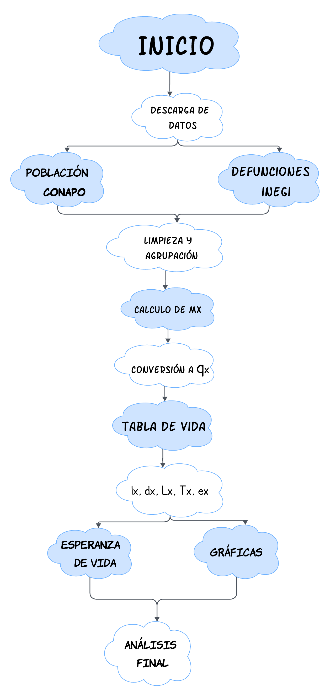
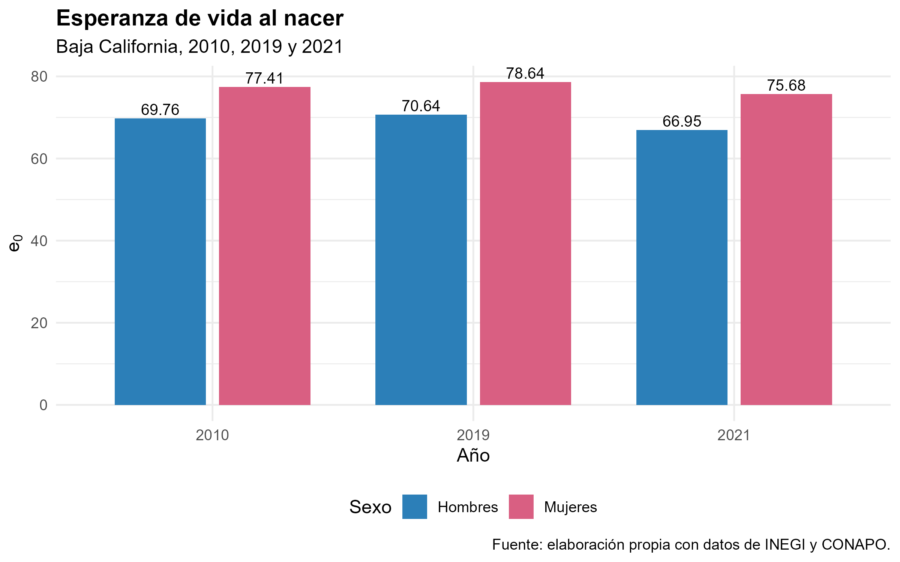
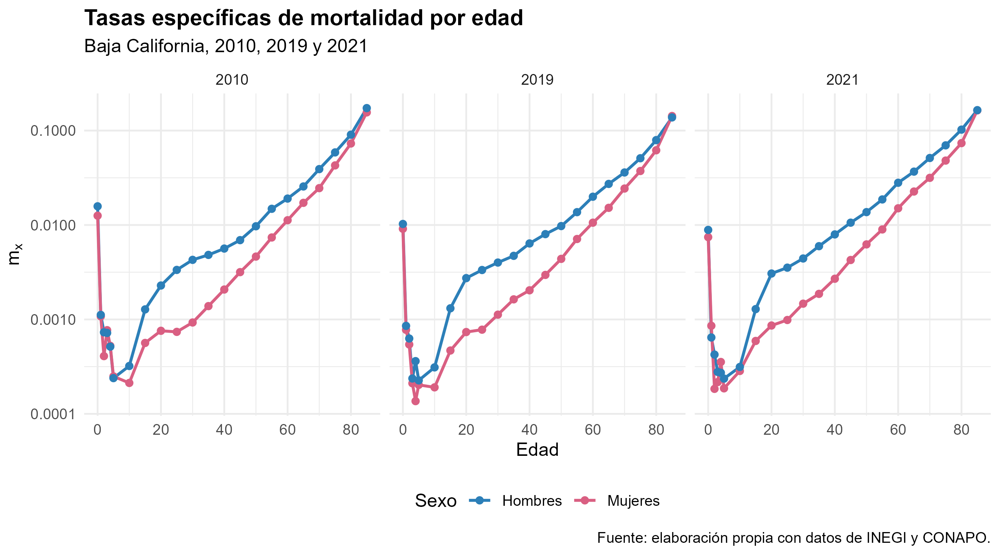
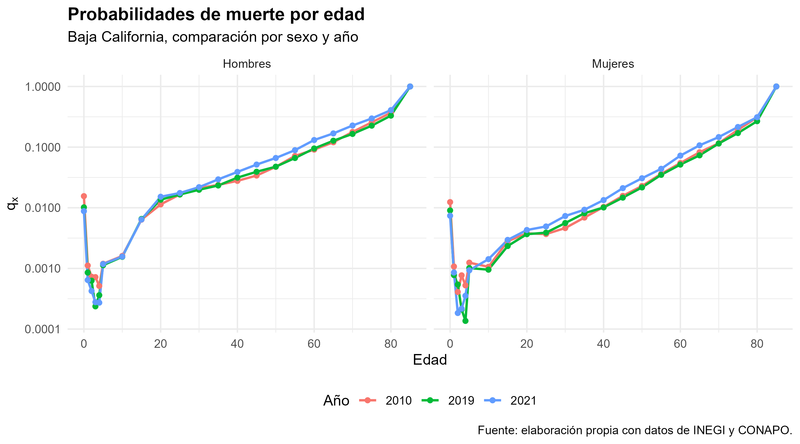
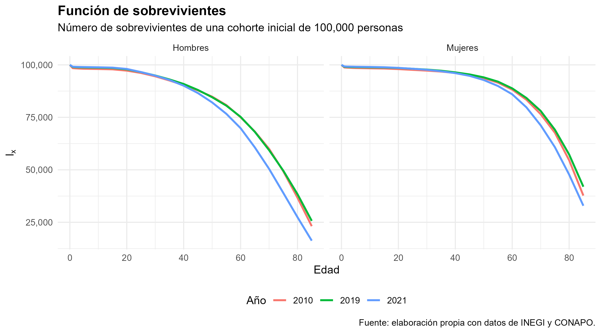
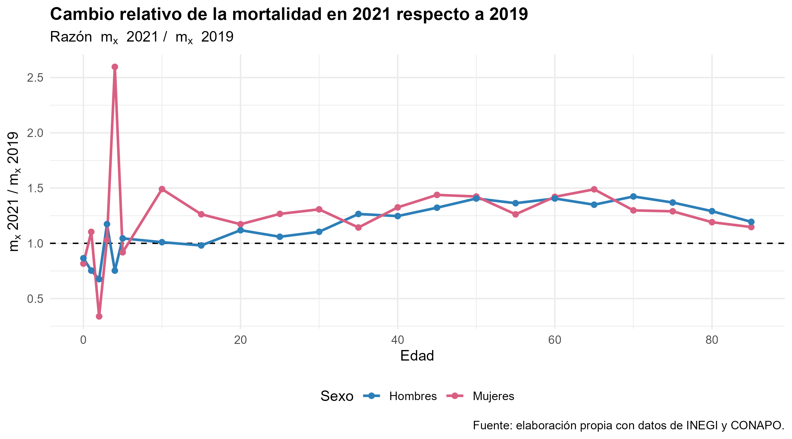

```{r setup, include=FALSE}
knitr::opts_chunk$set(
  echo = TRUE,
  warning = FALSE,
  message = FALSE,
  fig.align = "center",
  fig.width = 7,
  fig.height = 4.5
)
```

{width="100%" fig-align="center"}

# Presentación

En este proyecto se construyen tablas de vida para el estado de **Baja California** en los años **2010, 2019 y 2021**, separadas por sexo. La finalidad es estimar indicadores de mortalidad como las tasas específicas de mortalidad, las probabilidades de muerte, la función de sobrevivientes y la esperanza de vida al nacer.

No solo se reportan los resultados finales, sino que también se documenta de forma clara el procedimiento seguido: fuentes de información, limpieza de datos, fórmulas utilizadas, construcción de las tablas de vida, elaboración de gráficas y análisis de los resultados.

Los años seleccionados permiten hacer una comparación importante. El año **2010** funciona como un punto base; **2019** representa un año previo a la pandemia, y **2021** permite observar el impacto de la COVID-19 sobre la mortalidad y la esperanza de vida.

# Contexto de Baja California y su relación con la mortalidad

Baja California es una entidad ubicada en el noroeste de México. Su ubicación fronteriza con Estados Unidos le da una dinámica demográfica muy particular, ya que existe una alta movilidad de personas por motivos laborales, comerciales, familiares y migratorios.

La población del estado se concentra principalmente en municipios urbanos como Tijuana, Mexicali y Ensenada. Esta concentración urbana puede influir en el comportamiento de la mortalidad, ya que modifica el acceso a servicios de salud, las condiciones de movilidad, los riesgos laborales y la exposición a causas externas como accidentes o violencia.

Además, Baja California presenta una estructura poblacional con fuerte presencia de población en edades productivas, debido en parte a la migración interna y a la actividad económica de la región. Esto es relevante porque la mortalidad no se distribuye de la misma forma en todas las edades: suele ser baja en edades infantiles y juveniles, pero aumenta de forma importante en edades adultas y avanzadas.

Algunas particularidades de Baja California que pueden estar asociadas al comportamiento de la mortalidad son:

-   Su condición fronteriza y la alta movilidad poblacional.
-   La concentración de población en zonas urbanas.
-   La presencia de población migrante en edades laborales.
-   La importancia de riesgos asociados a causas externas, especialmente en hombres jóvenes y adultos.
-   El impacto de la pandemia de COVID-19 en 2021, principalmente en edades adultas y avanzadas.

Por estas razones, el análisis de mortalidad para Baja California no debe limitarse solo al cálculo de las tablas de vida. También es importante interpretar cómo las características sociales, urbanas y demográficas del estado ayudan a explicar los cambios observados entre 2010, 2019 y 2021.

# Fuentes de información

Para construir las tablas de vida se utilizarán principalmente dos tipos de información:

1.  **Población por edad y sexo**, necesaria para aproximar la población expuesta al riesgo.
2.  **Defunciones por edad y sexo**, necesarias para calcular las tasas específicas de mortalidad.

La población expuesta al riesgo se aproximó con la población a mitad de año publicada por CONAPO, desagregada por edad, sexo y entidad federativa. Esta base ya proporciona estimaciones anuales, por lo que para los cálculos principales no fue necesario interpolar la población.

Las defunciones se obtuvieron de las estadísticas de defunciones registradas de INEGI. Para el procesamiento, se organizaron por año, sexo y edad. Además, se dejaron abiertas las edades 0, 1, 2, 3 y 4, y posteriormente se utilizaron grupos quinquenales de 5-9 hasta 80-84, con un grupo abierto de 85 años y más.

# Diagrama de flujo del proceso

El siguiente diagrama resume el procedimiento general que se siguió para construir las tablas de vida. Se separan las dos fuentes principales de información —población y defunciones— y después se integran para calcular las funciones de la tabla de vida. De manera más detallada, el proceso consistió en descargar las bases originales, limpiar población y defunciones, agrupar las edades de forma compatible, calcular las tasas específicas de mortalidad, convertirlas en probabilidades de muerte y construir las funciones de la tabla de vida. Finalmente, se obtuvieron las esperanzas de vida al nacer y las gráficas para interpretar el efecto de la COVID-19. {width="100%" fig-align="center"}

```{r diagrama-flujo, echo=FALSE, eval=FALSE}
# En este espacio después insertaremos el diagrama de flujo.
# Por ejemplo:
# knitr::include_graphics("Imagenes/diagrama_flujo.png")
```

# Metodología

En esta sección se presentan las fórmulas principales utilizadas para construir las tablas de vida. La idea es dejar claro qué se calculó y por qué cada paso es necesario.

## Población expuesta al riesgo y crecimiento exponencial

Para construir las tasas de mortalidad se necesita una aproximación de la población expuesta al riesgo. En este proyecto se utilizó la población a mitad de año de CONAPO, agrupada de forma compatible con las defunciones: edades abiertas 0, 1, 2, 3 y 4; grupos quinquenales de 5-9 hasta 80-84; y grupo abierto de 85 años y más.

Aunque en los cálculos finales se utilizó directamente la población a mitad de año, se incluye la fórmula de crecimiento exponencial porque es una herramienta útil cuando se requiere estimar población entre dos fechas censales. La tasa de crecimiento continuo para la edad $x$ se define como:

$$
r_x = \frac{\ln(P_x(t_2)) - \ln(P_x(t_1))}{t_2 - t_1}
$$

donde:

-   $P_x(t_1)$ es la población de edad $x$ en el primer momento.
-   $P_x(t_2)$ es la población de edad $x$ en el segundo momento.
-   $r_x$ es la tasa de crecimiento continuo para la edad $x$.

La población estimada en el tiempo $t$ se calcula como:

$$
\widehat{P}_x(t) = P_x(t_1)e^{r_x(t-t_1)}
$$

Esta población estimada será utilizada como aproximación de la población expuesta al riesgo.

## Tasa específica de mortalidad

La tasa específica de mortalidad por edad se calcula como:

$$
m_x = \frac{D_x}{E_x}
$$

donde:

-   $D_x$ representa las defunciones observadas en la edad o grupo de edad $x$.
-   $E_x$ representa la población expuesta al riesgo en la edad o grupo de edad $x$.

Esta tasa indica la intensidad de la mortalidad observada en cada edad.

## Conversión de $m_x$ a $q_x$

Para construir la tabla de vida se requiere convertir la tasa específica de mortalidad $m_x$ en probabilidad de muerte $q_x$. Para intervalos de amplitud $n$, se utilizará la siguiente expresión:

$$
{}_nq_x = \frac{n \cdot {}_nm_x}{1 + (n - {}_na_x){}_nm_x}
$$

donde:

-   ${}_nq_x$ es la probabilidad de morir entre las edades $x$ y $x+n$.
-   ${}_nm_x$ es la tasa específica de mortalidad del intervalo.
-   ${}_na_x$ es el número promedio de años vividos dentro del intervalo por quienes mueren en él.
-   $n$ es la amplitud del intervalo.

## Funciones de la tabla de vida

La tabla de vida se construye iniciando con una raíz:

$$
l_0 = 100000
$$

Esto significa que la tabla parte de una cohorte hipotética de 100,000 nacimientos.

Las defunciones de la tabla se calculan como:

$$
d_x = l_xq_x
$$

Los sobrevivientes al inicio del siguiente intervalo se obtienen mediante:

$$
l_{x+n} = l_x - d_x
$$

Los años-persona vividos dentro del intervalo son:

$$
L_x = n l_{x+n} + a_x d_x
$$

El total de años-persona por vivir a partir de la edad $x$ es:

$$
T_x = \sum_{y \geq x} L_y
$$

Finalmente, la esperanza de vida a la edad $x$ se calcula como:

$$
e_x = \frac{T_x}{l_x}
$$

En particular, la esperanza de vida al nacer corresponde a:

$$
e_0 = \frac{T_0}{l_0}
$$

# Código utilizado

Para que el proyecto sea reproducible, el código se organizó en scripts separados. Cada script corresponde a una etapa del proceso: limpieza de población, limpieza de defunciones, unión de bases, construcción de tablas de vida y elaboración de gráficas.

```{r codigo_utilizado, eval=FALSE}
source("scripts/01_limpieza_poblacion.R")
source("scripts/02_limpieza_defunciones.R")
source("scripts/03_union_apv_mx.R")
source("scripts/04_tablas_vida.R")
source("scripts/05_graficas.R")
```

```{r ejecutar_scripts, include=FALSE}
source("scripts/01_limpieza_poblacion.R")
source("scripts/02_limpieza_defunciones.R")
source("scripts/03_union_apv_mx.R")
source("scripts/04_tablas_vida.R")
source("scripts/05_graficas.R")
```

```{r cargar_resultados, include=FALSE}
library(data.table)
library(dplyr)
library(tidyr)
library(knitr)

poblacion_bc <- fread("data/clean/poblacion_bc.csv")
defunciones_bc <- fread("data/clean/defunciones_bc.csv")
lt_input_bc <- fread("data/clean/lt_input_bc.csv")
tabla_vida_bc <- fread("data/clean/tabla_vida_bc.csv")
esperanza_vida_bc <- fread("data/clean/esperanza_vida_bc.csv")
```

# Resultados

En esta sección se presentan los principales resultados obtenidos a partir de la construcción de las tablas de vida para Baja California en los años 2010, 2019 y 2021. Los resultados se muestran por sexo, con el fin de comparar la evolución de la mortalidad masculina y femenina antes y durante el periodo asociado a la pandemia de COVID-19.

## Esperanza de vida al nacer

La esperanza de vida al nacer, denotada por $e_0$, resume el número promedio de años que viviría una persona recién nacida si durante toda su vida estuviera expuesta a las condiciones de mortalidad observadas en el año analizado.

```{r tabla_e0, echo=FALSE, message=FALSE, warning=FALSE}
library(data.table)
library(knitr)

esperanza_vida_bc <- fread("data/clean/esperanza_vida_bc.csv")

kable(
  esperanza_vida_bc,
  caption = "Esperanza de vida al nacer por sexo y año en Baja California",
  digits = 2
)
```

```{r grafica_e0, echo=FALSE, message=FALSE, warning=FALSE, fig.align='center', out.width='85%'}

```

## Gráficas principales

```{r grafica_mx, echo=FALSE, message=FALSE, warning=FALSE, fig.align='center', out.width='95%'}

```

```{r grafica_qx, echo=FALSE, message=FALSE, warning=FALSE, fig.align='center', out.width='95%'}

```

```{r grafica_lx, echo=FALSE, message=FALSE, warning=FALSE, fig.align='center', out.width='95%'}

```

```{r grafica_covid, echo=FALSE, message=FALSE, warning=FALSE, fig.align='center', out.width='95%'}

```

```{r ejemplo_tabla_vida, echo=FALSE, message=FALSE, warning=FALSE}
library(data.table)
library(dplyr)
library(knitr)

tabla_vida_bc <- fread("data/clean/tabla_vida_bc.csv")

tabla_vida_bc %>%
  filter(year == 2021, sex == "m") %>%
  select(year, sex, age, n, mx, qx, ax, lx, dx, Lx, Tx, ex) %>%
  head(12) %>%
  kable(
    caption = "Primeras edades de la tabla de vida para hombres, Baja California 2021",
    digits = 4
  )
```

# Análisis de resultados

Los resultados muestran que entre 2010 y 2019 hubo una ligera mejora en la esperanza de vida al nacer en Baja California. En hombres, la esperanza de vida pasó de 69.76 a 70.64 años, mientras que en mujeres pasó de 77.41 a 78.64 años. Esto indica una reducción general de la mortalidad antes de la pandemia.

También se observa que las mujeres presentan una esperanza de vida mayor que los hombres en los tres años analizados. Esta diferencia es consistente con el comportamiento usual de la mortalidad, ya que los hombres suelen presentar mayores riesgos en edades jóvenes y adultas, especialmente por causas externas, accidentes, violencia y otros factores asociados al contexto social y laboral.

En 2021 se observa una ruptura clara respecto a la tendencia previa. La esperanza de vida al nacer disminuyó a 66.95 años en hombres y a 75.68 años en mujeres. Esto representa una pérdida aproximada de 3.69 años para hombres y 2.96 años para mujeres respecto a 2019.

Las gráficas de $m_x$, $q_x$ y $l_x$ muestran que el aumento de la mortalidad en 2021 afectó principalmente a edades adultas y avanzadas. En la función de sobrevivientes, la curva de 2021 cae más rápido que la de 2019, especialmente en hombres, lo que refleja condiciones de mortalidad más desfavorables durante ese año.

# Impacto de la COVID-19 en 2021

El año 2021 refleja el impacto de la pandemia de COVID-19 sobre la mortalidad en Baja California. A diferencia de 2010 y 2019, que muestran una tendencia de mejora en la esperanza de vida, 2021 presenta una caída importante.

En hombres, la esperanza de vida pasó de 70.64 años en 2019 a 66.95 años en 2021. En mujeres, pasó de 78.64 a 75.68 años. La caída fue mayor en hombres, lo cual sugiere que la mortalidad masculina fue más afectada durante este periodo.

La gráfica de cambio relativo de la mortalidad, medida como $m_x^{2021}/m_x^{2019}$, permite observar en qué edades la mortalidad de 2021 fue mayor que la de 2019. Cuando la razón está por arriba de 1, significa que la mortalidad aumentó. En la gráfica se observa que varias edades adultas y avanzadas presentan razones mayores que 1, lo cual es consistente con el efecto de la pandemia.

En términos demográficos, la COVID-19 actuó como un choque de mortalidad: interrumpió la tendencia de mejora observada antes de la pandemia y redujo temporalmente la esperanza de vida al nacer.

# Validación de resultados

Para revisar que las tablas de vida sean coherentes, se verificarán los siguientes puntos:

-   Que las probabilidades de muerte $q_x$ estén entre 0 y 1.
-   Que la función de sobrevivientes $l_x$ sea decreciente.
-   Que la raíz de la tabla sea $l_0 = 100000$.
-   Que las defunciones $d_x$ sean no negativas.
-   Que $T_x$ sea decreciente conforme aumenta la edad.
-   Que la esperanza de vida al nacer $e_0$ coincida con el valor reportado en la primera fila de la tabla de vida.

Esta revisión es importante porque permite detectar errores de cálculo, problemas de limpieza de datos o inconsistencias en la construcción de la tabla.

# Conclusiones

La construcción de tablas de vida para Baja California permitió analizar el comportamiento de la mortalidad por edad, sexo y año. A partir de las funciones $m_x$, $q_x$, $l_x$, $d_x$, $L_x$, $T_x$ y $e_x$, fue posible comparar las condiciones de mortalidad en 2010, 2019 y 2021.

Entre 2010 y 2019 se observa una mejora en la esperanza de vida al nacer. En hombres aumentó de 69.76 a 70.64 años, mientras que en mujeres aumentó de 77.41 a 78.64 años. Esto sugiere una reducción de la mortalidad antes de la pandemia.

En 2021 se observa una caída clara en la esperanza de vida. Para hombres bajó a 66.95 años y para mujeres a 75.68 años. Este resultado muestra el impacto de la COVID-19 sobre la mortalidad de la entidad.

También se confirma que las mujeres presentan mayor esperanza de vida que los hombres en todos los años analizados. Esta diferencia puede relacionarse con la mayor mortalidad masculina en edades jóvenes y adultas, así como con la exposición a causas externas y otros riesgos.

Finalmente, el proyecto quedó organizado de forma reproducible mediante datos, scripts, gráficas y un informe elaborado en Quarto. Esto permite que el procedimiento pueda revisarse y replicarse desde el repositorio de GitHub.

# Referencias

-   CONAPO. Proyecciones de la población de México y de las entidades federativas.
-   INEGI. Censo de Población y Vivienda.
-   INEGI. Estadísticas de defunciones registradas.
-   Notas de clase de Demografía.
