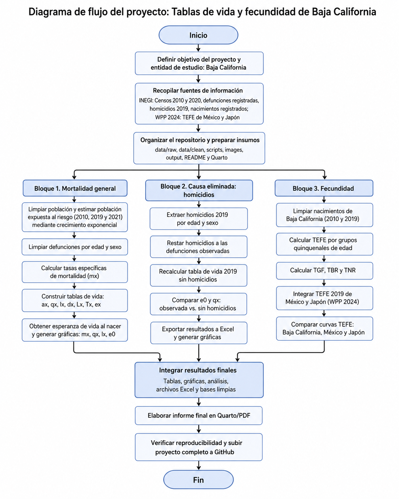
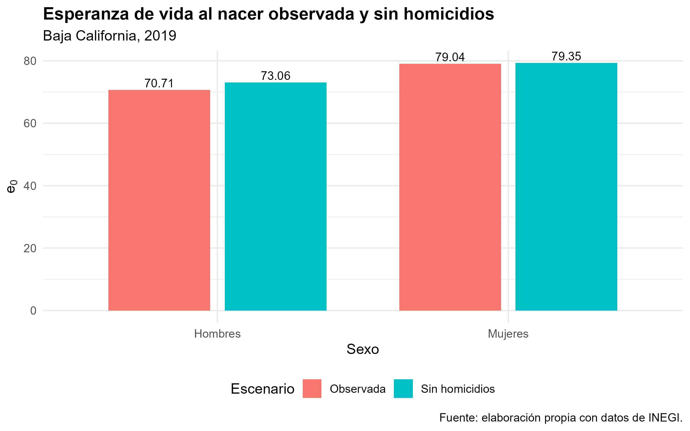
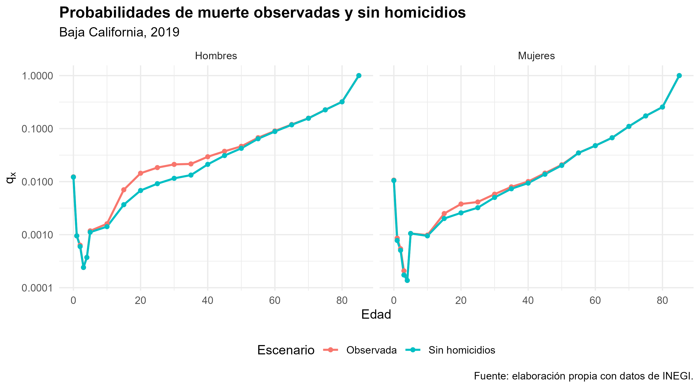
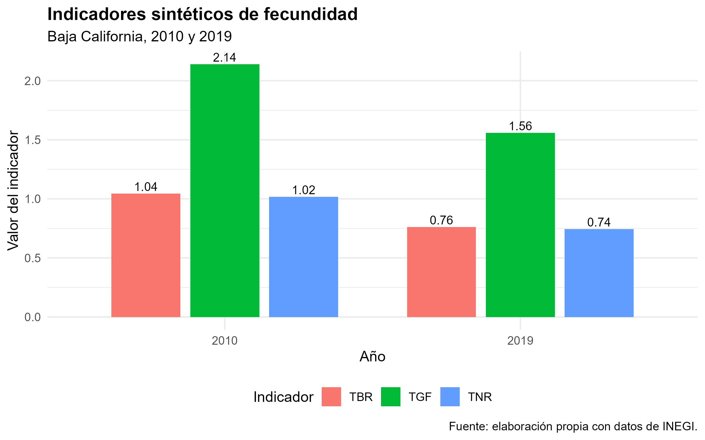
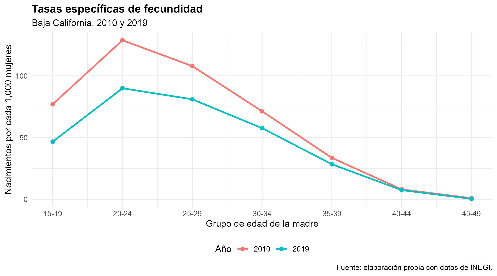
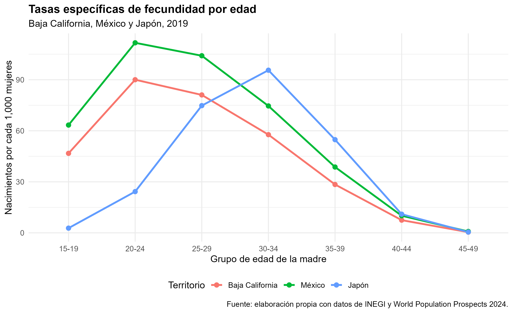

```{r setup, include=FALSE}
knitr::opts_chunk$set(
  echo = TRUE,
  warning = FALSE,
  message = FALSE,
  fig.align = "center",
  fig.width = 7,
  fig.height = 4.5
)
```

{width="100%" fig-align="center"}

# Presentación

En este proyecto se construyen tablas de vida para el estado de **Baja California** en los años **2010, 2019 y 2021**, separadas por sexo. La finalidad es estimar indicadores de mortalidad como las tasas específicas de mortalidad, las probabilidades de muerte, la función de sobrevivientes y la esperanza de vida al nacer.

No solo se reportan los resultados finales, sino que también se documenta de forma clara el procedimiento seguido: fuentes de información, limpieza de datos, fórmulas utilizadas, construcción de las tablas de vida, elaboración de gráficas y análisis de los resultados.

Los años seleccionados permiten hacer una comparación importante. El año **2010** funciona como un punto base; **2019** representa un año previo a la pandemia, y **2021** permite observar el impacto de la COVID-19 sobre la mortalidad y la esperanza de vida.

# Contexto de Baja California y su relación con la mortalidad

Baja California es una entidad ubicada en el noroeste de México. Su ubicación fronteriza con Estados Unidos le da una dinámica demográfica muy particular, ya que existe una alta movilidad de personas por motivos laborales, comerciales, familiares y migratorios.

La población del estado se concentra principalmente en municipios urbanos como Tijuana, Mexicali y Ensenada. Esta concentración urbana puede influir en el comportamiento de la mortalidad, ya que modifica el acceso a servicios de salud, las condiciones de movilidad, los riesgos laborales y la exposición a causas externas como accidentes o violencia.

Además, Baja California presenta una estructura poblacional con fuerte presencia de población en edades productivas, debido en parte a la migración interna y a la actividad económica de la región. Esto es relevante porque la mortalidad no se distribuye de la misma forma en todas las edades: suele ser baja en edades infantiles y juveniles, pero aumenta de forma importante en edades adultas y avanzadas.

Algunas particularidades de Baja California que pueden estar asociadas al comportamiento de la mortalidad son:

-   Su condición fronteriza y la alta movilidad poblacional.
-   La concentración de población en zonas urbanas.
-   La presencia de población migrante en edades laborales.
-   La importancia de riesgos asociados a causas externas, especialmente en hombres jóvenes y adultos.
-   El impacto de la pandemia de COVID-19 en 2021, principalmente en edades adultas y avanzadas.

Por estas razones, el análisis de mortalidad para Baja California no debe limitarse solo al cálculo de las tablas de vida. También es importante interpretar cómo las características sociales, urbanas y demográficas del estado ayudan a explicar los cambios observados entre 2010, 2019 y 2021.

# Fuentes de información

Para construir las tablas de vida se utilizarán principalmente dos tipos de información:

1.  **Población por edad y sexo**, necesaria para aproximar la población expuesta al riesgo.
2.  **Defunciones por edad y sexo**, necesarias para calcular las tasas específicas de mortalidad.

La población se obtuvo de los tabulados del Censo de Población y Vivienda 2010 y del Censo de Población y Vivienda 2020 de INEGI. Como no existe un censo para 2019 ni para 2021, se utilizó crecimiento exponencial por edad y sexo para estimar la población expuesta al riesgo en los años de análisis.

Las defunciones se obtuvieron de las estadísticas de defunciones registradas de INEGI. Para el procesamiento, se organizaron por año, sexo y edad. Además, se dejaron abiertas las edades 0, 1, 2, 3 y 4, y posteriormente se utilizaron grupos quinquenales de 5-9 hasta 80-84, con un grupo abierto de 85 años y más.

# Diagrama de flujo del proceso

El siguiente diagrama resume el flujo completo del proyecto. A diferencia de la primera versión, ahora se incluyen los tres bloques principales del análisis: la construcción de tablas de vida generales, la tabla de vida con causa eliminada por homicidios y el cálculo de indicadores de fecundidad.

El proceso inicia con la definición del objetivo y la recopilación de fuentes de información. Posteriormente, se organizan los insumos en carpetas reproducibles y se desarrollan tres rutas de cálculo: mortalidad general, causa eliminada y fecundidad. Finalmente, los resultados se integran en tablas, gráficas, archivos Excel y el informe final en Quarto/PDF.

```{r diagrama-flujo-final, echo=FALSE, out.width="100%", fig.align="center", fig.cap="Diagrama de flujo del proyecto: tablas de vida y fecundidad de Baja California."}

```

# Metodología

En esta sección se presentan las fórmulas principales utilizadas para construir las tablas de vida. La idea es dejar claro qué se calculó y por qué cada paso es necesario.

## Población expuesta al riesgo y crecimiento exponencial

Para construir las tasas de mortalidad se necesita una aproximación de la población expuesta al riesgo. En este proyecto se utilizó información poblacional de INEGI proveniente del Censo de Población y Vivienda 2010 y del Censo de Población y Vivienda 2020.

Como los años de análisis son 2010, 2019 y 2021, y no todos corresponden directamente a levantamientos censales, se estimó la población expuesta al riesgo mediante crecimiento exponencial por edad y sexo. Este procedimiento permitió aproximar la población a mitad de año a partir de los censos de población de 2010 y 2020. La tasa de crecimiento continuo para la edad $x$ se define como:

$$ r_x = \frac{\ln(P_x(t_2)) - \ln(P_x(t_1))}{t_2 - t_1} $$

donde:

-   $P_x(t_1)$ es la población de edad $x$ en el primer momento.
-   $P_x(t_2)$ es la población de edad $x$ en el segundo momento.
-   $r_x$ es la tasa de crecimiento continuo para la edad $x$.

La población estimada en el tiempo $t$ se calcula como:

$$
\widehat{P}_x(t) = P_x(t_1)e^{r_x(t-t_1)}
$$

Esta población estimada será utilizada como aproximación de la población expuesta al riesgo.

## Tasa específica de mortalidad

La tasa específica de mortalidad por edad se calcula como:

$$
m_x = \frac{D_x}{E_x}
$$

donde:

-   $D_x$ representa las defunciones observadas en la edad o grupo de edad $x$.
-   $E_x$ representa la población expuesta al riesgo en la edad o grupo de edad $x$.

Esta tasa indica la intensidad de la mortalidad observada en cada edad.

## Conversión de $m_x$ a $q_x$

Para construir la tabla de vida se requiere convertir la tasa específica de mortalidad $m_x$ en probabilidad de muerte $q_x$. Para intervalos de amplitud $n$, se utilizará la siguiente expresión:

$$
{}_nq_x = \frac{n \cdot {}_nm_x}{1 + (n - {}_na_x){}_nm_x}
$$

donde:

-   ${}_nq_x$ es la probabilidad de morir entre las edades $x$ y $x+n$.
-   ${}_nm_x$ es la tasa específica de mortalidad del intervalo.
-   ${}_na_x$ es el número promedio de años vividos dentro del intervalo por quienes mueren en él.
-   $n$ es la amplitud del intervalo.

## Funciones de la tabla de vida

La tabla de vida se construye iniciando con una raíz:

$$
l_0 = 100000
$$

Esto significa que la tabla parte de una cohorte hipotética de 100,000 nacimientos.

Las defunciones de la tabla se calculan como:

$$
d_x = l_xq_x
$$

Los sobrevivientes al inicio del siguiente intervalo se obtienen mediante:

$$
l_{x+n} = l_x - d_x
$$

Los años-persona vividos dentro del intervalo son:

$$
L_x = n l_{x+n} + a_x d_x
$$

El total de años-persona por vivir a partir de la edad $x$ es:

$$
T_x = \sum_{y \geq x} L_y
$$

Finalmente, la esperanza de vida a la edad $x$ se calcula como:

$$
e_x = \frac{T_x}{l_x}
$$

En particular, la esperanza de vida al nacer corresponde a:

$$
e_0 = \frac{T_0}{l_0}
$$

# Código utilizado

Para que el proyecto sea reproducible, el código se organizó en scripts separados. Cada script corresponde a una etapa específica del proceso: limpieza de población, limpieza de defunciones, unión de bases, construcción de tablas de vida y elaboración de gráficas.

```{r tabla_scripts, echo=FALSE, message=FALSE, warning=FALSE}
library(knitr)

scripts_usados <- data.frame(
  Script = c(
    "01_limpieza_poblacion.R",
    "02_limpieza_defunciones.R",
    "03_union_apv_mx.R",
    "04_tablas_vida.R",
    "05_graficas.R",
    "06_causa_eliminada_homicidios.R",
    "07_fecundidad_bc.R",
    "08_fecundidad_comparativa.R"
  ),
  Función = c(
    "Lee la población de INEGI 2010 y 2020, agrupa edades y estima población por crecimiento exponencial.",
    "Limpia defunciones de INEGI, deja abiertas las edades 0 a 4 y prorratea valores no especificados.",
    "Une población y defunciones para calcular tasas específicas de mortalidad.",
    "Construye las funciones de la tabla de vida y calcula esperanza de vida al nacer.",
    "Genera las gráficas principales de mortalidad.",
    "Construye la tabla de vida 2019 con causa eliminada por homicidios, exporta Excel y genera gráficas comparativas.",
    "Calcula TEFE, TGF, TBR y TNR para Baja California en 2010 y 2019.",
    "Construye la comparación de TEFE 2019 entre Baja California, México y Japón."
  )
)

kable(
  scripts_usados,
  caption = "Scripts implementados en el proyecto"
)
```


A continuación se muestran fragmentos representativos del código utilizado. No se incluye todo el código para no saturar el informe, pero sí las partes centrales del procedimiento.

## Fragmento del script de población

Este fragmento muestra cómo se calcula la tasa de crecimiento exponencial y cómo se estima la población para los años de análisis.

```{r codigo_poblacion, eval=FALSE}
# Unir censos 2010 y 2020 para calcular crecimiento exponencial
pob_base <- pob_2010 %>%
  select(sex, age, n, pop_2010 = pop) %>%
  inner_join(
    pob_2020 %>% select(sex, age, n, pop_2020 = pop),
    by = c("sex", "age", "n")
  ) %>%
  mutate(
    r = log(pop_2020 / pop_2010) / (t_2020 - t_2010)
  )

# Estimar población para 2010, 2019 y 2021
poblacion_bc <- merge(pob_base, objetivos, by = NULL) %>%
  mutate(
    pop = pop_2010 * exp(r * (t - t_2010)),
    pop = round(pop, 0)
  ) %>%
  select(year, sex, age, n, pop)
```

## Fragmento del script de defunciones

Este fragmento muestra cómo se organiza la base de defunciones y cómo se dejan separadas las edades 0, 1, 2, 3 y 4.

```{r codigo_defunciones, eval=FALSE}
mapa_edades <- tibble(
  edad_txt = c(
    "Menores de 1 año",
    "1 año", "2 años", "3 años", "4 años",
    "5-9 años", "10-14 años", "15-19 años",
    "20-24 años", "25-29 años", "30-34 años",
    "35-39 años", "40-44 años", "45-49 años",
    "50-54 años", "55-59 años", "60-64 años",
    "65-69 años", "70-74 años", "75-79 años",
    "80-84 años", "85 años y más"
  ),
  age = c(
    0, 1, 2, 3, 4,
    5, 10, 15, 20, 25, 30, 35, 40,
    45, 50, 55, 60, 65, 70, 75, 80, 85
  ),
  n = c(
    1, 1, 1, 1, 1,
    rep(5, 16),
    NA
  )
)

def_validas <- def_raw %>%
  inner_join(mapa_edades, by = "edad_txt")
```

## Fragmento del cálculo de tasas de mortalidad

Este fragmento muestra cómo se unen población y defunciones para calcular la tasa específica de mortalidad.

```{r codigo_mx, eval=FALSE}
lt_input_bc <- poblacion_bc %>%
  left_join(
    defunciones_bc,
    by = c("year", "sex", "age", "n")
  ) %>%
  mutate(
    mx = deaths / pop
  ) %>%
  arrange(year, sex, age)
```

## Fragmento de construcción de tabla de vida

Este fragmento muestra las fórmulas principales usadas para calcular $q_x$, $l_x$, $d_x$, $L_x$, $T_x$ y $e_x$.

```{r codigo_tabla_vida, eval=FALSE}
datos <- datos %>%
  arrange(age) %>%
  mutate(
    ax = asignar_ax(age, n),
    qx = case_when(
      age == 85 ~ 1,
      TRUE ~ (n * mx) / (1 + (n - ax) * mx)
    ),
    qx = pmin(pmax(qx, 0), 1)
  )

lx[1] <- 100000

for (i in 1:k) {
  dx[i] <- lx[i] * datos$qx[i]
  
  if (i < k) {
    lx[i + 1] <- lx[i] - dx[i]
  }
}

for (i in 1:k) {
  if (datos$age[i] == 85) {
    Lx[i] <- lx[i] / datos$mx[i]
  } else {
    Lx[i] <- datos$n[i] * lx[i + 1] + datos$ax[i] * dx[i]
  }
}

Tx <- rev(cumsum(rev(Lx)))
ex <- Tx / lx
```

## Ejecución completa del proyecto

El flujo completo del proyecto se ejecuta con los siguientes scripts:

```{r codigo_fuente, eval=FALSE}
source("scripts/01_limpieza_poblacion.R")
source("scripts/02_limpieza_defunciones.R")
source("scripts/03_union_apv_mx.R")
source("scripts/04_tablas_vida.R")
source("scripts/05_graficas.R")
source("scripts/06_causa_eliminada_homicidios.R")
source("scripts/07_fecundidad_bc.R")
source("scripts/08_fecundidad_comparativa.R")
```

```{r ejecutar_scripts, include=FALSE}
source("scripts/01_limpieza_poblacion.R")
source("scripts/02_limpieza_defunciones.R")
source("scripts/03_union_apv_mx.R")
source("scripts/04_tablas_vida.R")
source("scripts/05_graficas.R")
```

```{r cargar_resultados, include=FALSE}
library(data.table)
library(dplyr)
library(tidyr)
library(knitr)

poblacion_bc <- fread("data/clean/poblacion_bc.csv")
defunciones_bc <- fread("data/clean/defunciones_bc.csv")
lt_input_bc <- fread("data/clean/lt_input_bc.csv")
tabla_vida_bc <- fread("data/clean/tabla_vida_bc.csv")
esperanza_vida_bc <- fread("data/clean/esperanza_vida_bc.csv")
```
# Resultados

En esta sección se presentan los principales resultados obtenidos a partir de la construcción de las tablas de vida para Baja California en los años 2010, 2019 y 2021. Los resultados se muestran por sexo, con el fin de comparar la evolución de la mortalidad masculina y femenina antes y durante el periodo asociado a la pandemia de COVID-19.

## Esperanza de vida al nacer

La esperanza de vida al nacer, denotada por $e_0$, resume el número promedio de años que viviría una persona recién nacida si durante toda su vida estuviera expuesta a las condiciones de mortalidad observadas en el año analizado.

```{r tabla_e0, echo=FALSE, message=FALSE, warning=FALSE}
library(data.table)
library(knitr)

esperanza_vida_bc <- fread("data/clean/esperanza_vida_bc.csv")

kable(
  esperanza_vida_bc,
  caption = "Esperanza de vida al nacer por sexo y año en Baja California",
  digits = 2
)
```

```{r grafica_e0, echo=FALSE, message=FALSE, warning=FALSE, fig.align='center', out.width='85%'}
knitr::include_graphics("graficas/e0_bc.png")
```

## Gráficas principales

```{r grafica_mx, echo=FALSE, message=FALSE, warning=FALSE, fig.align='center', out.width='95%'}
knitr::include_graphics("graficas/mx_bc.png")
```

```{r grafica_qx, echo=FALSE, message=FALSE, warning=FALSE, fig.align='center', out.width='95%'}
knitr::include_graphics("graficas/qx_bc.png")
```

```{r grafica_lx, echo=FALSE, message=FALSE, warning=FALSE, fig.align='center', out.width='95%'}
knitr::include_graphics("graficas/lx_bc.png")
```

```{r grafica_covid, echo=FALSE, message=FALSE, warning=FALSE, fig.align='center', out.width='95%'}
knitr::include_graphics("graficas/impacto_covid_mx_bc.png")
```

```{r ejemplo_tabla_vida, echo=FALSE, message=FALSE, warning=FALSE}
library(data.table)
library(dplyr)
library(knitr)

tabla_vida_bc <- fread("data/clean/tabla_vida_bc.csv")

tabla_vida_bc %>%
  filter(year == 2021, sex == "m") %>%
  select(year, sex, age, n, mx, qx, ax, lx, dx, Lx, Tx, ex) %>%
  head(12) %>%
  kable(
    caption = "Primeras edades de la tabla de vida para hombres, Baja California 2021",
    digits = 4
  )
```

# Análisis de resultados

Los resultados muestran que entre 2010 y 2019 hubo una mejora en la esperanza de vida al nacer en Baja California. En hombres, la esperanza de vida pasó de 69.70 a 70.71 años, mientras que en mujeres pasó de 77.46 a 79.04 años. Esto indica una reducción general de la mortalidad antes de la pandemia.

También se observa que las mujeres presentan una esperanza de vida mayor que los hombres en los tres años analizados. Esta diferencia es consistente con el comportamiento usual de la mortalidad, ya que los hombres suelen presentar mayores riesgos en edades jóvenes y adultas, especialmente por causas externas, accidentes, violencia y otros factores asociados al contexto social y laboral.

En 2021 se observa una ruptura clara respecto a la tendencia previa. La esperanza de vida al nacer disminuyó a 67.35 años en hombres y a 76.43 años en mujeres. Esto representa una pérdida aproximada de 3.36 años para hombres y 2.61 años para mujeres respecto a 2019.

Las gráficas de $m_x$, $q_x$ y $l_x$ muestran que el aumento de la mortalidad en 2021 afectó principalmente a edades adultas y avanzadas. En la función de sobrevivientes, la curva de 2021 cae más rápido que la de 2019, especialmente en hombres, lo que refleja condiciones de mortalidad más desfavorables durante ese año.

# Impacto de la COVID-19 en 2021

El año 2021 refleja el impacto de la pandemia de COVID-19 sobre la mortalidad en Baja California. A diferencia de 2010 y 2019, que muestran una tendencia de mejora en la esperanza de vida, 2021 presenta una caída importante.

En hombres, la esperanza de vida pasó de 70.71 años en 2019 a 67.35 años en 2021. En mujeres, pasó de 79.04 a 76.43 años. La caída fue mayor en hombres en términos absolutos, lo cual sugiere que la mortalidad masculina fue más afectada durante este periodo.

La gráfica de cambio relativo de la mortalidad, medida como $m_x^{2021}/m_x^{2019}$, permite observar en qué edades la mortalidad de 2021 fue mayor que la de 2019. Cuando la razón está por arriba de 1, significa que la mortalidad aumentó. En la gráfica se observa que varias edades adultas y avanzadas presentan razones mayores que 1, lo cual es consistente con el efecto de la pandemia.

En términos demográficos, la COVID-19 actuó como un choque de mortalidad: interrumpió la tendencia de mejora observada antes de la pandemia y redujo temporalmente la esperanza de vida al nacer.

# Tabla de vida 2019 con causa eliminada: homicidios

Para evaluar el impacto de los homicidios sobre la mortalidad de Baja California, se construyó una tabla de vida de 2019 eliminando esta causa de muerte. El procedimiento consistió en restar las defunciones por homicidio a las defunciones totales observadas en 2019, por edad y sexo. Después se recalcularon las tasas específicas de mortalidad, las probabilidades de muerte y las funciones de la tabla de vida.

```{r tabla-e0-causa-eliminada, echo=FALSE, message=FALSE, warning=FALSE}
library(data.table)
library(knitr)

e0_causa_eliminada <- fread("data/clean/homicidios/e0_causa_eliminada.csv")

kable(
  e0_causa_eliminada,
  caption = "Esperanza de vida al nacer observada y sin homicidios. Baja California, 2019",
  digits = 2
)
```

```{r grafica-e0-causa-eliminada, echo=FALSE, out.width="90%", fig.align="center", fig.cap="Esperanza de vida al nacer observada y sin homicidios por sexo. Baja California, 2019."}

```

La eliminación hipotética de los homicidios muestra un efecto considerable sobre la esperanza de vida masculina. En hombres, la esperanza de vida observada en 2019 fue de 70.71 años, mientras que al eliminar los homicidios aumentaría a 73.06 años. Esto representa una ganancia aproximada de 2.35 años.

En mujeres, el cambio es mucho menor. La esperanza de vida observada fue de 79.04 años y, al eliminar los homicidios, aumentaría a 79.35 años, es decir, una ganancia aproximada de 0.31 años.

Este resultado indica que los homicidios tienen un impacto mucho más fuerte en la mortalidad masculina que en la femenina. En términos demográficos, la causa eliminada permite observar que una parte importante de la brecha entre hombres y mujeres está asociada a causas externas, particularmente homicidios, que afectan principalmente a hombres jóvenes y adultos.

```{r grafica-qx-causa-eliminada, echo=FALSE, out.width="90%", fig.align="center", fig.cap="Probabilidades de muerte observadas y sin homicidios por sexo. Baja California, 2019."}

```

La gráfica de $q_x$ permite ver en qué edades cambia la mortalidad al eliminar los homicidios. En hombres, la diferencia entre la curva observada y la curva sin homicidios se aprecia principalmente en edades jóvenes y adultas, donde los homicidios tienen mayor peso relativo dentro de las defunciones. En mujeres, las curvas son muy similares, lo cual es consistente con la menor participación de los homicidios en la mortalidad femenina.

# Validación de resultados

Para revisar que las tablas de vida sean coherentes, se verificarán los siguientes puntos:

-   Que las probabilidades de muerte $q_x$ estén entre 0 y 1.
-   Que la función de sobrevivientes $l_x$ sea decreciente.
-   Que la raíz de la tabla sea $l_0 = 100000$.
-   Que las defunciones $d_x$ sean no negativas.
-   Que $T_x$ sea decreciente conforme aumenta la edad.
-   Que la esperanza de vida al nacer $e_0$ coincida con el valor reportado en la primera fila de la tabla de vida.

Esta revisión es importante porque permite detectar errores de cálculo, problemas de limpieza de datos o inconsistencias en la construcción de la tabla.

# Metodología de fecundidad

Además de las tablas de vida, se calcularon indicadores sintéticos de fecundidad para Baja California en 2010 y 2019. Para ello se utilizaron nacimientos registrados de INEGI por año de ocurrencia, edad de la madre al momento del nacimiento y entidad de residencia habitual de la madre.

Las edades reproductivas se agruparon en intervalos quinquenales:

$$[15-19,\ 20-24,\ 25-29,\ 30-34,\ 35-39,\ 40-44,\ 45-49]$$

La tasa específica de fecundidad por edad se calculó como:

$${}_5f_x = \frac{B_x}{M_x}$$

donde:

- $B_x$ representa los nacimientos ocurridos de madres en el grupo de edad $x$.
- $M_x$ representa la población femenina expuesta al riesgo en el grupo de edad $x$.

Para fines gráficos, también se expresa como nacimientos por cada 1,000 mujeres:

$$
{}_5f_x^{(1000)} = {}_5f_x \cdot 1000.$$

La Tasa Global de Fecundidad se calculó como:

$$TGF = 5 \sum_{x=15}^{45} {}_5f_x$$

La Tasa Bruta de Reproducción se obtuvo multiplicando la TGF por la proporción teórica de nacimientos femeninos:

$$K = \frac{100}{205}=0.4878$$

Por tanto:

$$TBR = TGF \cdot K$$

Finalmente, la Tasa Neta de Reproducción se calculó incorporando la sobrevivencia femenina hasta las edades reproductivas:

$$TNR = 5K \sum_{x=15}^{45} {}_5f_x \cdot {}_{x+2.5}p_0^{f}$$

En este caso, \({}_{x+2.5}p_0^{f}\) representa la probabilidad aproximada de que una mujer sobreviva desde el nacimiento hasta la edad media del grupo reproductivo correspondiente.

# Nivel de reemplazo: por qué se usa 2.1

El nivel de reemplazo se refiere al nivel de fecundidad necesario para que, en promedio, una generación de mujeres sea sustituida por otra generación del mismo tamaño. En términos demográficos, esto ocurre cuando la Tasa Neta de Reproducción es igual a 1:

$$TNR = 1$$

La Tasa Bruta de Reproducción considera solamente los nacimientos femeninos. Si se supone que por cada 205 nacimientos hay aproximadamente 100 mujeres y 105 hombres, entonces la proporción de nacimientos femeninos es:

$$K = \frac{100}{205}=0.4878$$

Si no existiera mortalidad femenina antes ni durante las edades reproductivas, la condición de reemplazo sería aproximadamente:

$$TBR = TGF \cdot K = 1$$

Despejando la TGF:

$$TGF = \frac{1}{K}$$

Sustituyendo $K = 0.4878$:

$$TGF = \frac{1}{0.4878} \approx 2.05$$

Sin embargo, en una población real sí existe mortalidad femenina desde el nacimiento hasta las edades reproductivas. Por esa razón, la TGF necesaria para lograr que la TNR sea igual a 1 debe ser ligeramente mayor que 2.05. De ahí surge el valor aproximado de:

$$TGF \approx 2.1$$

Por eso, una Tasa Global de Fecundidad cercana a 2.1 hijos por mujer se considera el nivel de reemplazo. Esta cifra no significa que todas las mujeres deban tener exactamente 2.1 hijos, sino que, bajo ciertos supuestos de mortalidad y composición por sexo al nacimiento, ese nivel permitiría que cada generación de mujeres sea reemplazada por una nueva generación de tamaño similar.

# Resultados de fecundidad

## Indicadores sintéticos de fecundidad

```{r tabla-fecundidad, echo=FALSE, message=FALSE, warning=FALSE}
library(data.table)
library(knitr)

indicadores_fecundidad_bc <- fread("data/clean/fecundidad/indicadores_fecundidad_bc.csv")

kable(
  indicadores_fecundidad_bc[, .(year, TGF, TBR, TNR, nacimientos_15_49, mujeres_15_49)],
  caption = "Indicadores sintéticos de fecundidad para Baja California, 2010 y 2019",
  digits = 3
)
```

Los resultados muestran una disminución importante de la fecundidad en Baja California entre 2010 y 2019. En 2010, la Tasa Global de Fecundidad fue de 2.140 hijos por mujer, valor muy cercano al nivel de reemplazo. La Tasa Bruta de Reproducción fue de 1.044 y la Tasa Neta de Reproducción fue de 1.016, lo que indica que, considerando la mortalidad femenina, la generación de mujeres apenas alcanzaba a reemplazarse.

En 2019, la TGF disminuyó a 1.559 hijos por mujer. La TBR bajó a 0.761 y la TNR a 0.743. Esto significa que, bajo las condiciones de fecundidad y mortalidad observadas en ese año, una generación de mujeres sería reemplazada por una generación considerablemente menor. En otras palabras, Baja California pasó de una fecundidad cercana al reemplazo en 2010 a una fecundidad claramente por debajo del reemplazo en 2019.

```{r grafica-indicadores-fecundidad, echo=FALSE, out.width="90%", fig.align="center", fig.cap="Indicadores sintéticos de fecundidad para Baja California, 2010 y 2019."}

```

## Tasas específicas de fecundidad en Baja California

```{r grafica-tefe-bc, echo=FALSE, out.width="90%", fig.align="center", fig.cap="Tasas específicas de fecundidad por edad para Baja California, 2010 y 2019."}

```

La curva de TEFE permite observar en qué edades se concentra la fecundidad. En Baja California, la fecundidad de 2019 fue menor que la de 2010, especialmente en edades jóvenes y adultas tempranas. Esto explica la caída de la TGF: no se trata únicamente de una reducción en un grupo de edad aislado, sino de una disminución general del calendario reproductivo.

## Comparación de TEFE 2019: Baja California, México y Japón

```{r tabla-tefe-comparativa, echo=FALSE, message=FALSE, warning=FALSE}
tefe_comparativa_2019 <- fread("data/clean/fecundidad/tefe_comparativa_2019.csv")

kable(
  tefe_comparativa_2019,
  caption = "Tasas específicas de fecundidad por cada 1,000 mujeres. Baja California, México y Japón, 2019",
  digits = 3
)
```

```{r grafica-tefe-comparativa, echo=FALSE, out.width="90%", fig.align="center", fig.cap="Curvas de tasas específicas de fecundidad por edad. Baja California, México y Japón, 2019."}

```

La comparación internacional muestra diferencias claras en el calendario de la fecundidad. México presenta tasas más altas que Baja California en todos los grupos de edad reproductiva, especialmente entre 20-24 y 25-29 años. Baja California mantiene una estructura similar a la nacional, pero con niveles más bajos.

Japón, en cambio, muestra un patrón distinto. La fecundidad adolescente es muy baja, con una TEFE de 2.772 nacimientos por cada 1,000 mujeres de 15 a 19 años. Además, su fecundidad se concentra en edades más tardías: el punto máximo se observa en el grupo 30-34, con 95.606 nacimientos por cada 1,000 mujeres. Esto contrasta con México y Baja California, donde las tasas más altas se concentran en edades más jóvenes, principalmente entre 20-24 y 25-29 años.

En conjunto, estos resultados muestran que Baja California no solo redujo su nivel de fecundidad entre 2010 y 2019, sino que también se encuentra en una posición intermedia: tiene niveles menores que México, pero un calendario reproductivo más temprano que Japón.

# Conclusiones

La construcción de tablas de vida para Baja California permitió analizar el comportamiento de la mortalidad por edad, sexo y año. A partir de las funciones $m_x$, $q_x$, $l_x$, $d_x$, $L_x$, $T_x$ y $e_x$, fue posible comparar las condiciones de mortalidad en 2010, 2019 y 2021.

Entre 2010 y 2019 se observa una mejora en la esperanza de vida al nacer. En hombres aumentó de 69.70 a 70.71 años, mientras que en mujeres aumentó de 77.46 a 79.04 años. Esto sugiere una reducción de la mortalidad antes de la pandemia.

En 2021 se observa una caída clara en la esperanza de vida. Para hombres bajó a 67.35 años y para mujeres a 76.43 años. Este resultado muestra el impacto de la COVID-19 sobre la mortalidad de la entidad.

La tabla de vida con causa eliminada muestra que los homicidios tuvieron un impacto importante sobre la esperanza de vida masculina en 2019. Al eliminar hipotéticamente esta causa de muerte, la esperanza de vida de los hombres aumentaría de 70.71 a 73.06 años, una ganancia de 2.35 años. En mujeres, el cambio sería mucho menor, de 79.04 a 79.35 años.

En cuanto a fecundidad, Baja California pasó de una TGF de 2.140 hijos por mujer en 2010 a 1.559 en 2019. Esto indica una transición hacia niveles claramente inferiores al reemplazo. La TNR también disminuyó de 1.016 a 0.743, lo que sugiere que, bajo las condiciones de fecundidad y mortalidad observadas en 2019, una generación de mujeres sería reemplazada por una generación de menor tamaño.

La comparación de las TEFE de 2019 mostró que Baja California tiene niveles menores que México, pero conserva un calendario reproductivo relativamente joven, con las tasas más altas entre 20-24 y 25-29 años. Japón, en cambio, presenta una fecundidad mucho más baja en edades adolescentes y concentra su máximo en el grupo 30-34 años.

Finalmente, el proyecto quedó organizado de forma reproducible mediante datos, scripts, archivos de salida, gráficas y un informe elaborado en Quarto. Esto permite que el procedimiento pueda revisarse y replicarse desde el repositorio de GitHub.

# Referencias

- Instituto Nacional de Estadística y Geografía (INEGI). Censo de Población y Vivienda 2010.  
  https://www.inegi.org.mx/programas/ccpv/2010/

- Instituto Nacional de Estadística y Geografía (INEGI). Censo de Población y Vivienda 2020.  
  https://www.inegi.org.mx/programas/ccpv/2020/

- Instituto Nacional de Estadística y Geografía (INEGI). Estadísticas de Defunciones Registradas.  
  https://www.inegi.org.mx/programas/edr/

- Instituto Nacional de Estadística y Geografía (INEGI). Defunciones por homicidios.  
  https://www.inegi.org.mx/sistemas/olap/consulta/general_ver4/MDXQueryDatos.asp

- Instituto Nacional de Estadística y Geografía (INEGI). Estadísticas de Natalidad. Nacimientos registrados.  
  https://www.inegi.org.mx/programas/natalidad/

- United Nations, Department of Economic and Social Affairs, Population Division. World Population Prospects 2024.  
  https://population.un.org/wpp/

- United Nations, Department of Economic and Social Affairs, Population Division. World Population Prospects 2024: Age-specific fertility rates by five-year age groups.  
  https://population.un.org/wpp/assets/Excel%20Files/1_Indicator%20(Standard)/EXCEL_FILES/3_Fertility/WPP2024_FERT_F02_FERTILITY_RATES_BY_5-YEAR_AGE_GROUPS_OF_MOTHER.xls

- Ortega, A. (1987). Tablas de mortalidad. Centro Latinoamericano de Demografía.

- Preston, S. H., Heuveline, P., & Guillot, M. (2001). Demography: Measuring and Modeling Population Processes. Blackwell Publishers.

- Notas de clase de Demografía.